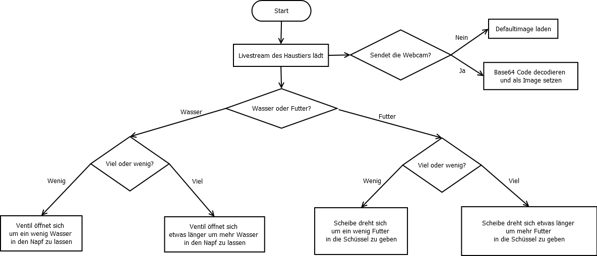
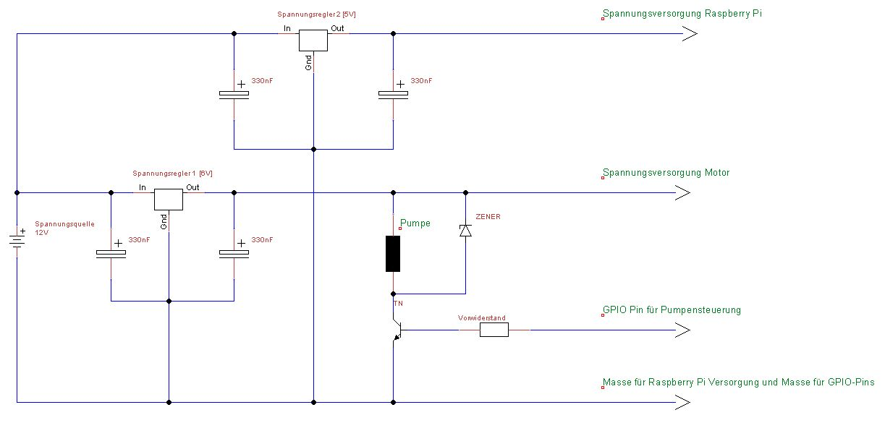
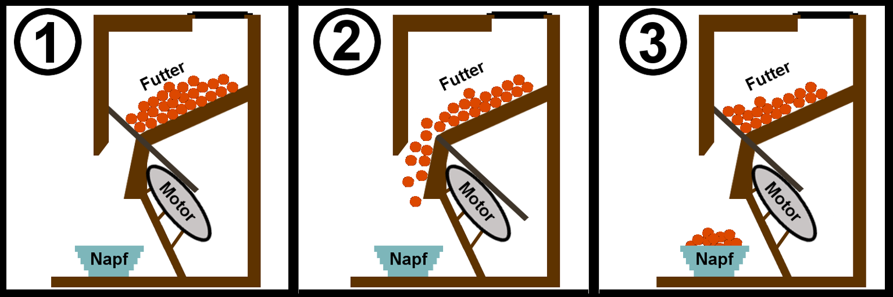

# Technische Dokumentation der Petcare-Futterstation&#8482;

## Einleitung
Die Petcare - Futterstation&#8482; ermöglicht es Tierbesitzern von überall auf der Welt, ihre Tiere mit Wasser und Nahrung zu versorgen. Zusätzlich wird ein 24/7h Livestream auf ihr Smartphone gesendet. Folgend wird beschrieben wie die technische Umsetzung erfolgt ist.

## Komponenten
<ul>
<li>Carson 500502015 - CS-3 Servo 3KG/JR (*Motor*)</li>
<li>Raspberry Pi 3</li>
<li>12V Tauchpumpe</li>
<li>Perforierte Aluminiumscheibe</li>
<li>USB Webcam</li>
</ul>

## Beschreibung der Kommunikation zwischen der App und des Raspberry Pi
Der Raspberry Pi wird angesteuert über eine Android App, die mit dem Ionic Framework gebaut wurde. Als Schnittstelle zwischen App und Raspberry Pi dient ein Broker. Über ein Topic (z.B. 'haw/dmi/mosy') können der Pi und die App kommunizieren, indem sie Daten senden bzw. empfangen.  
Es gibt 4 Auswahlmöglichkeiten in unserer App (Viel Wasser, wenig Wasser, viel Futter, wenig Futter). Wird einer der Buttons gedrückt, wird ein String an den Broker gesendet:
```javascript
//Amount of food to be deployed
$("#smallFood-btn").click(function(){
  message = new Paho.MQTT.Message("00"); //<---- Hier wird die "00" übertragen
  message.destinationName = "haw/dmi/mt/its/petcare";
  client.send(message);
  $(".food-amount").toggleClass("button-active");
});
```
Auf dem Pi wird zu Beginn ein Pythonskript gestartet. Erhält der Pi nun z.B. die Nachricht "00" (s.o.) so dreht sich der Motor mit der Lochscheibe kurz. Bei "01" wäre es lang.
```python
if payload == '00':
  try:
    p.ChangeDutyCycle(7.5)
    time.sleep(0.7)
    p.ChangeDutyCycle(2.5)
    time.sleep(0.7)
    p.ChangeDutyCycle(7.5)
    time.sleep(0.7)
    p.ChangeDutyCycle(2.5)
  except KeyboardInterrupt:
    p.stop()
    GPIO.cleanup()
```
Das Wasser wird über "10" bzw "11" ausgegeben. Hierbei wird eine Tauchpumpe entweder kurz oder lang angesteuert:
```python
elif payload == '10':
  GPIO.output(5, True)
  time.sleep(2)
  GPIO.output(5,False)


elif payload == '11':
  GPIO.output(5, True)
  time.sleep(4)
  GPIO.output(5,False)
```
Der Webcam Livestream erfolgt mittels einer USB Webcam, die jede Sekunde ein Bild macht, welches der Raspberry Pi in base64 kodiert. Das Linux Package, dass benutzt wird ist "fswebcam".
```python
try:
  while True:
    command="fswebcam image.jpg --no-banner"
    os.system(command)
    with open("image.jpg", "rb") as image_file:
      encoded_string = base64.b64encode(image_file.read())
    client.publish(topic,encoded_string,qos=2,retain=False)
    time.sleep(1)
except KeyboardInterrupt:
  print("interrupted")
```
Dieser base64 kodierte Code wird dann von der App wieder entschlüsselt, in PNG Format umgewandelt und als Image eingefügt.
```javascript
// called when a message arrives
function onMessageArrived(message) {
  console.log("onMessageArrived:"+message.payloadString);
  if(message.payloadString != "00" && message.payloadString != "01" && message.payloadString != "10" && message.payloadString != "11"){
    let base64_encoded = message.payloadString;
    let image = "data:image/png;base64,"+base64_encoded;
    $("#security-cam").attr("src",image);
  }
}
```  


## Flussdiagramm


<div style="page-break-after: always;"></div>

## Blockschaltbild


## Darstellung des Innenlebens(Futterausgabe)

