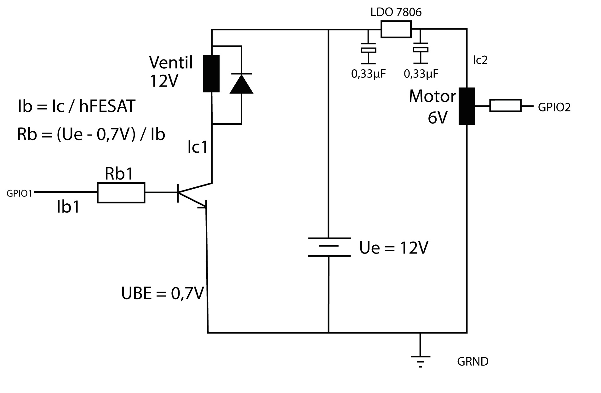

# Technische Dokumentation der PetcareBox

## Komponenten
<ul>
<li>Carson 500502015 - CS-3 Servo 3KG/JR (*Motor*)</li>
<li>Raspberry Pi 3</li>
<li>Pumpe</li>
<li>Perforierte Aluminiumscheibe</li>
<li>???</li>
</ul>

## Beschreibung der Kommunikation zwischen der App und des Raspberry Pi
---> Hier kommt die Beschreibung hin

## Flussdiagramm

## Blockschaltbild

